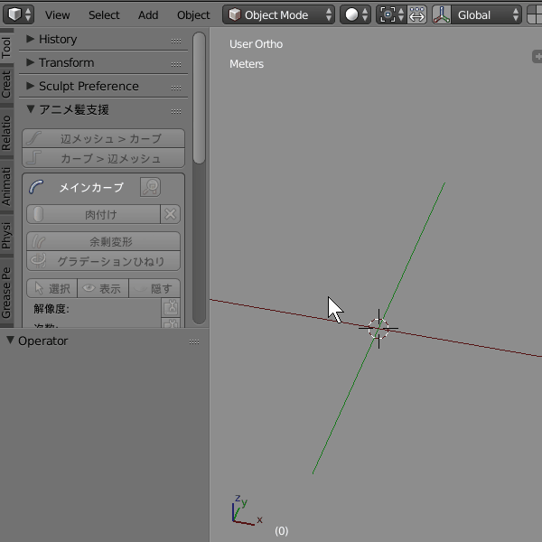

# Blender-AnimeHairSupporter
Blender 2.80 対応版は Anime Hair Supporter 280 に入っている。Blender 2.80 はツールの位置が「サイドバー（N）> ツール > アニメ髪支援」に変更されている。  

# ライセンス
元のアドオンのライセンスは Apache-2.0 ですが、Blender Python API を使用しているため GPL ライセンスになります。ライセンスに関しては[ Blender is Free Software](https://code.blender.org/2019/06/blender-is-free-software/) や [FAQ](https://www.blender.org/support/faq/)を参照。

# 使い方
1. カーブを作成する
2. __オブジェクトモード__ にする
3. 「ツールシェルフ（ショートカット T） > アニメ髪支援 > 肉付け」を押す
4. カーブを編集する
5. 「カーブ > メッシュ」でメッシュ化する

## 解像度
横方向の解像度はメインカーブの解像度から、縦方向の解像度はベベルカーブの解像度から変更できる。  

## テーパーカーブ・ベベルカーブ
「種類を変更」を押すと、左下のウインドウからテーパー・ベベルの形を変更できる。
